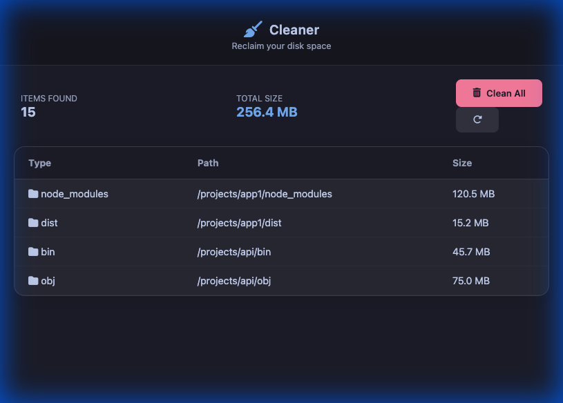

# Cleaner (Pure Rust Edition)

A high-performance, native desktop application designed to reclaim disk space by recursively finding and safely deleting heavy build directories and dependency caches (`node_modules`, `dist`, `target`, `bin`, `obj`, `venv`, `__pycache__`, `build`, etc.).

Built **100% purely in Rust** with **egui / eframe**, offering native performance, instant startup, minimal memory consumption, and zero JavaScript/Node.js dependencies.




## Features

- **100% Pure Rust**: Zero Node.js, zero Electron, zero Webview, zero browser bloat. Single standalone native binary.
- **Ultra Fast & Multi-Threaded**: Non-blocking background worker threads for scanning and deletion with 60 FPS UI responsiveness.
- **Modern Dark UI**: Clean, responsive interface styled with dark mode and custom interactive cards.
- **Deep Scanning & Intelligent Traversal**: Recursively detects build and dependency folders while avoiding scanning inside already matched targets.
- **Customizable Target Filters**:
  - **Node.js**: `node_modules`, `dist`
  - **.NET**: `bin`, `obj`
  - **Rust**: `target`
  - **Go**: `bin`, `pkg`
  - **Python**: `__pycache__`, `venv`, `.venv`, `.pytest_cache`, `.tox`
  - **Flutter / Dart**: `build`, `.dart_tool`
- **Smart & Safe**:
  - Computes exact folder sizes.
  - Multi-selection and sorting by size.
  - Safety confirmation dialog before deletion.
  - Detailed post-cleanup summary of freed disk space.

## Prerequisites

- [Rust & Cargo](https://rustup.rs/) (version 1.77 or newer)

To install Rust on macOS or Linux:
```bash
curl --proto '=https' --tlsv1.2 -sSf https://sh.rustup.rs | sh
```

## Installation & Running

1. Clone the repository:
   ```bash
   git clone https://github.com/yourusername/RGDev.App.CleanerNM.git
   cd RGDev.App.CleanerNM
   ```

2. Run the application:
   ```bash
   cargo run --release
   ```

3. Build a standalone release binary:
   ```bash
   cargo build --release
   ```
   The optimized executable will be located at `target/release/cleaner`.

## Workflow

1. **Select Workspace**: Click **"📂 Browse System"** to pick the root folder you want to scan (e.g., your projects directory).
2. **Configure Targets**: Toggle the target language/framework categories you want to clean.
3. **Scan**: Click **"🚀 Start Deep Scan"**. The app traverses directories in the background while displaying real-time progress.
4. **Review & Filter**: View all found directories, their paths, and their calculated sizes. Select or deselect folders, or sort by size.
5. **Clean**: Click **"🗑 Clean Selected"**, confirm the action in the safety dialog, and let the app delete the targets to reclaim disk space.

## Architecture

- **`src/main.rs`**: Native application entry point and window viewport configuration using `eframe`.
- **`src/app.rs`**: Reactive GUI layer implemented with `egui`, handling application states (`Selecting`, `Scanning`, `Results`, `ConfirmClean`, `Cleaning`, `Done`).
- **`src/scanner.rs`**: Multi-threaded file system scanner and deletion engine with channels for zero-lag UI updates and accurate folder size calculation.

## License

MIT
