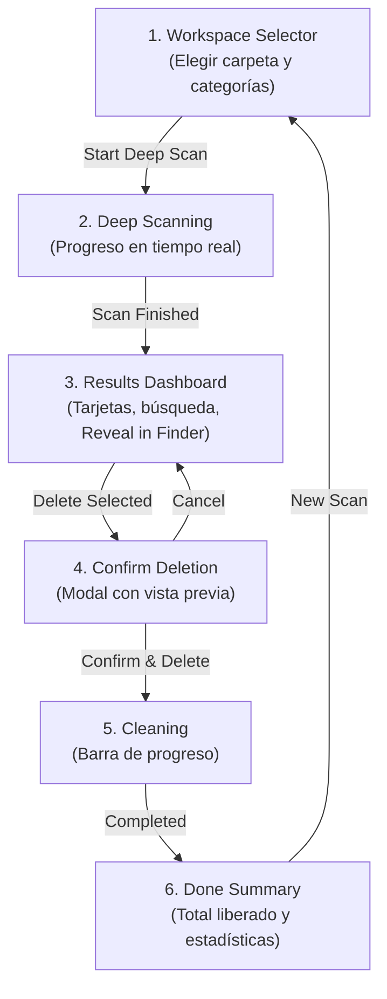

# Cleaner (Pure Rust Native Edition)

A high-performance, native desktop application designed to reclaim disk space by recursively scanning and safely deleting heavy build directories and dependency caches (`node_modules`, `dist`, `target`, `bin`, `obj`, `venv`, `__pycache__`, `build`, `.dart_tool`, etc.).

Built **100% purely in Rust** with **egui / eframe**, offering native performance, instant startup, minimal memory consumption (< 30 MB RAM), and zero JavaScript/Node.js dependencies.


---

## 🚀 Características Principales

- **100% Pura en Rust**: Cero Node.js, cero Electron, cero WebView y cero Chromium. Binario único y autónomo de ~6.0 MB.
- **Concurrencia sin Bloqueos**: Hilos dedicados en segundo plano para escaneo y eliminación comunicados mediante canales `crossbeam-channel` (interfaz fluida a 60 FPS).
- **Rutas Completas y Visibilidad Total**:
  - Distintivo explícito de eliminación: `WILL DELETE: [folder_name]/` en rojo de advertencia.
  - Nombre del proyecto en negrita (`Project: [nombre]`) junto a su ruta relativa.
  - Ruta absoluta completa en texto monospace sin truncar a `/Users...`.
  - Botón **"Reveal in Finder"** para inspeccionar la carpeta en el explorador antes de eliminarla.
  - Botón **"Copy Path"** para copiar la ruta al portapapeles.
- **Búsqueda y Filtros en Tiempo Real**:
  - Barra de búsqueda interactiva: filtra instantáneamente por nombre de proyecto, carpeta o ruta.
  - Píldoras de filtrado por categoría de tecnología (`All`, `Node.js`, `Flutter`, `Rust`, `.NET`, `Python`, `Go`).
  - Ordenamiento por tamaño (mayor a menor o menor a mayor).
- **Filtros por Categoría de Desarrollo**:
  - **Node.js**: `node_modules`, `dist`
  - **.NET**: `bin`, `obj`
  - **Rust**: `target`
  - **Go**: `bin`, `pkg`
  - **Python**: `__pycache__`, `venv`, `.venv`, `.pytest_cache`, `.tox`
  - **Flutter / Dart**: `build`, `.dart_tool`
- **Seguridad Garantizada**:
  - Cálculo exacto de tamaño por directorio.
  - Modal de confirmación con vista previa detallada de todas las carpetas a eliminar.
  - Resumen post-limpieza con total de espacio recuperado.

---

## 🖥️ Flujo y Pantallas de la Aplicación



### 1. Selector de Espacio de Trabajo (`Selecting`)
- Botón **"Browse System..."** que invoca el selector nativo del sistema operativo (`rfd`).
- Rejilla de categorías con interruptores individuales para elegir qué tecnologías analizar.

### 2. Escaneo en Vivo (`Scanning`)
- Recorrido recursivo multihilo que emite eventos de progreso en tiempo real.
- Muestra el total de carpetas atravesadas, objetivos detectados y tamaño acumulado sin congelar la ventana.

### 3. Panel de Resultados (`Results`)
- Tarjeta de estadísticas en la parte superior:
  - **Folders Found**: Cantidad de carpetas detectadas.
  - **Total Reclaimable**: Espacio total recuperable en disco (ej. `19.18 GB`).
  - **Selected for Deletion**: Cantidad y tamaño seleccionado en tiempo real.
- Barra de herramientas con caja de búsqueda, ordenamiento y selección rápida (`Select All` / `Deselect All`).
- Tarjetas estructuradas con distintivo `WILL DELETE: [folder]/`, nombre de proyecto, ruta absoluta legible y botones de inspección.

### 4. Confirmación de Seguridad (`ConfirmClean`)
- Vista previa de cada carpeta que será destruida con su tamaño individual y advertencia de acción irreversible.

### 5. Progreso de Limpieza (`Cleaning`)
- Barra de porcentaje y nombre de la carpeta que se está eliminando en cada instante.

### 6. Resumen de Éxito (`Done`)
- Reporte final con la cantidad de carpetas eliminadas y el total de gigabytes liberados.

---

## 🛠️ Arquitectura del Código Fuente

El proyecto sigue una arquitectura modular en Rust:

```text
RGDev.App.CleanerNM/
├── Cargo.toml          # Dependencias (eframe, egui, rfd, walkdir, crossbeam-channel)
├── .changelog/         # Historial de cambios técnico y de proyecto
└── src/
    ├── main.rs         # Punto de entrada y configuración del viewport de la ventana (1060x720)
    ├── app.rs          # Interfaz gráfica reactiva con egui, gestión de estados y tarjetas
    └── scanner.rs      # Motor de escaneo concurrente, cálculo de tamaño y borrado seguro
```

- **`src/main.rs`**: Configura `eframe::NativeOptions` con resolución inicial espaciosa (1060x720), dimensiones mínimas (800x560) y título nativo.
- **`src/app.rs`**: Implementa el trait `eframe::App` mediante la máquina de estados `AppState`. Controla el panel superior, la barra de búsqueda, la lista de tarjetas y el renderizado a 60 FPS con tema oscuro personalizado.
- **`src/scanner.rs`**: Define `ScanItem` y las rutinas de recorrido con `walkdir`. Emplea `it.skip_current_dir()` para no gastar recursos entrando en subcarpetas de objetivos ya identificados y calcula recursivamente el tamaño en bytes.

---

## 📋 Prerrequisitos

- [Rust & Cargo](https://rustup.rs/) (versión 1.77 o superior)

Para instalar o actualizar Rust:
```bash
curl --proto '=https' --tlsv1.2 -sSf https://sh.rustup.rs | sh
source "$HOME/.cargo/env"
```

---

## 📦 Compilación y Ejecución Local

### Ejecución en Modo Desarrollo
```bash
cargo run
```

### Ejecución en Modo Release (Optimizado)
```bash
cargo run --release
```

### Compilar el Binario Standalone
```bash
cargo build --release
```
El ejecutable optimizado quedará disponible en:
```text
target/release/cleaner
```

---

## 🚢 Workflow para Compilar y Publicar Releases

Para generar y publicar nuevas versiones de **Cleaner**, sigue el flujo estándar a continuación:

### 1. Validación de Pruebas y Compilación
Antes de cualquier release, asegúrate de que los tests y la compilación pasen sin advertencias:
```bash
cargo test
cargo check
cargo build --release
```

### 2. Incrementar la Versión en `Cargo.toml`
Actualiza el campo `version` en `Cargo.toml`:
```toml
[package]
name = "cleaner"
version = "1.0.1" # o 1.1.0 según corresponda
```

### 3. Compilación Multiplataforma / Creación de Assets
Puedes empaquetar el binario para tu plataforma:
- **macOS**:
  ```bash
  cargo build --release
  cp target/release/cleaner cleaner-macos
  tar -czf cleaner-macos-v1.0.0.tar.gz cleaner-macos
  ```
- **Windows** (compilación en Windows o con cross-compilación):
  ```bash
  cargo build --release
  # Genera target/release/cleaner.exe
  ```
- **Linux**:
  ```bash
  cargo build --release
  # Genera target/release/cleaner
  ```

### 4. Automatización con GitHub Actions (Workflow CI/CD)
Si deseas que GitHub compile y publique automáticamente los binarios para macOS, Windows y Linux cada vez que crees un tag (ej. `v1.0.0`), crea el archivo `.github/workflows/release.yml` en GitHub con el siguiente contenido:

```yaml
name: Release

on:
  push:
    tags:
      - 'v*'
  workflow_dispatch:

jobs:
  release:
    permissions:
      contents: write
    strategy:
      fail-fast: false
      matrix:
        include:
          - os: macos-latest
            asset_name: cleaner-macos-universal
          - os: windows-latest
            asset_name: cleaner-windows-x86_64.exe
          - os: ubuntu-latest
            asset_name: cleaner-linux-x86_64

    runs-on: ${{ matrix.os }}

    steps:
      - name: Checkout repository
        uses: actions/checkout@v4

      - name: Install Rust stable
        uses: dtolnay/rust-toolchain@stable

      - name: Install Linux dependencies
        if: runner.os == 'Linux'
        run: |
          sudo apt-get update
          sudo apt-get install -y libx11-dev libxcursor-dev libxrandr-dev libxi-dev libxinerama-dev libgl1-mesa-dev libxcb-render0-dev libxcb-shape0-dev libxcb-xfixes0-dev

      - name: Build Release Binary
        run: cargo build --release

      - name: Rename Release Asset (Windows)
        if: runner.os == 'Windows'
        run: cp target/release/cleaner.exe ${{ matrix.asset_name }}

      - name: Rename Release Asset (Unix)
        if: runner.os != 'Windows'
        run: cp target/release/cleaner ${{ matrix.asset_name }}

      - name: Upload Binaries to GitHub Release
        uses: softprops/action-gh-release@v2
        if: startsWith(github.ref, 'refs/tags/')
        with:
          files: ${{ matrix.asset_name }}
          name: 'Cleaner ${{ github.ref_name }}'
          draft: false
          prerelease: false
        env:
          GITHUB_TOKEN: ${{ secrets.GITHUB_TOKEN }}
```

> **Nota:** Para subir este workflow a GitHub sin errores de OAuth en SourceTree, debes crearlo directamente desde la interfaz web de GitHub en `.github/workflows/release.yml` o asegurar que tu Personal Access Token cuente con el permiso `workflow`.

### 5. Lanzar un Release con Git Tags
```bash
git tag v1.0.0
git push origin v1.0.0
```

---

## 📄 Licencia

Este proyecto está licenciado bajo la licencia MIT. Consulta el archivo [LICENSE](LICENSE) para más información.
